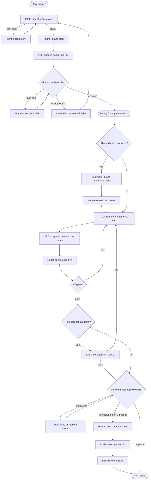
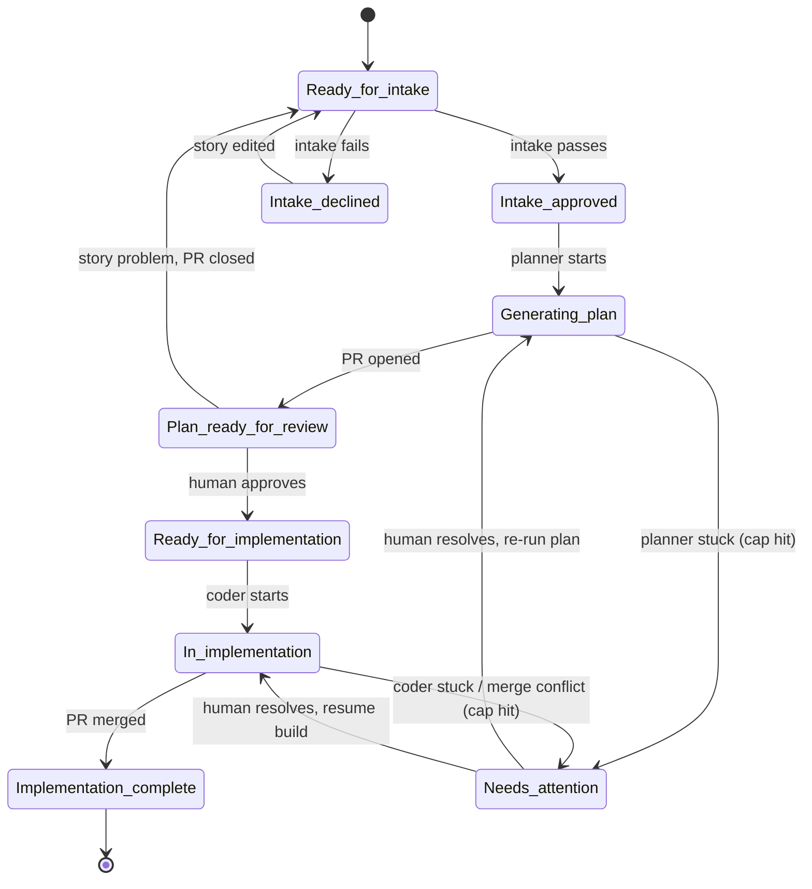

# AI-native dev flow — Design Document

**Scope.** This document describes the **plan phase**, the **build phase**, and the **dreaming phase** of the flow — intake, planning, plan review, implementation, code review, how those steps are triggered and executed, and how the flow learns from its own exhaust to improve its agents. All three phases are **functionally designed**; phases that follow (deployment onward) are documented as they are decided. The rationale behind every choice recorded here is kept in the companion `design-log.md` (decisions D1–D16).

---

## 1. Overview

A **user story** is the unit of work. The flow has two linear, functionally designed phases — **plan** and **build** — plus a non-linear **dreaming phase** that runs alongside them and feeds improvements back into the agents.

The **plan phase** moves a story through three stages:

1. An **intake agent** checks the story is well-formed and ready to plan against.
2. A **planner agent** turns an approved story into an implementation plan, delivered as a GitHub pull request.
3. A **human** reviews and approves that plan.

It ends with an approved, merged plan — the item is `Ready for implementation`.

The **build phase** turns that plan into merged code:

1. Optionally, a **test-writer agent** writes failing behavioral tests from the spec, which a human reviews before any code is written.
2. A **coding agent** implements the spec, adding unit tests as it goes; a **polish agent** does in-context cleanup.
3. The coder opens a code PR; **CI** runs the objective gates, including a live/end-to-end test of the running application when the plan called for it.
4. A **reviewer agent**, independent of the coder, reviews for spec alignment, missed edge cases, and the cross-cutting concerns tests can't capture; the two iterate in the PR, with a human breaking any deadlock.

It ends with a merged PR — the item is `Implementation complete`. Throughout both phases, a single `AIND status` tag on the Azure DevOps work item records where the item is, while the GitHub PRs own the fine-grained iteration.

Running alongside both phases is the **dreaming phase** — a non-linear, cross-story improvement loop. Each agent emits a structured *lessons-learned* record at the end of its session; on a regular basis a separate, independent **dreamer agent** reviews the accumulated lessons and proposes improvements to the agent-config layer (skills, agent prompts, the readiness rubric, project rules) as a pull request against `.claude`. A human accepts or rejects each proposal. This is the flow's feedback path: the rest of the flow turns stories into code, while the dreaming phase turns the experience of doing so into better agents — without ever changing the flow itself.

---

## 2. Actors

| Actor | Type | Responsibility |
|---|---|---|
| Intake agent | Automated | Scores a story for readiness; records its reasoning as comments; suggests fixes but never edits the story itself. |
| Planner agent | Automated | Produces the implementation plan and opens it as a GitHub PR. |
| Coding agent | Automated | Implements the merged spec; writes unit-level tests for the seams it creates; opens the code PR; applies fixes during review, including a human's verdict. |
| Test-writer agent | Automated | Optional, planner-gated. Cold, independent: writes failing behavioral/acceptance-level tests from the merged spec before implementation; re-grounded from artifacts only, never the coder's context. |
| E2E test agent | Automated | Optional, planner-gated. Cold, independent: authors and runs live, user-visible end-to-end scenarios against the running application before merge; re-grounded from artifacts only. A project may instead satisfy this gate with a developer testing manually (no agent). |
| Polish agent | Automated | In-context (warm) cleanup before the PR — code style, formatting, self-consistency. Not an independent check, by design. |
| Reviewer agent | Automated | Cold, independent review of the code PR for spec alignment, missed edge cases, and cross-cutting concerns the behavioral suite can't enforce (coding style, auth, logging); re-grounded from artifacts only, never the coder's context. |
| Dreamer agent | Automated | Cold, independent. Runs in the dreaming phase on a regular cadence; reviews the *lessons-learned* records emitted by every other agent and proposes improvements to the agent-config layer as a PR against `.claude`. Re-grounded from the emitted lessons and artifacts only, never any agent's running context. Proposes only — a human accepts or rejects; bounded to config, never the flow itself (see §5 Dreaming phase). |
| Onboarding agent | Automated | One-time, pre-flow. Reads an existing codebase, discovers its domains, and **drafts** the initial `.claude/` config (per-domain project rules, a wired `CLAUDE.md`, project skills from discovered build/test/run commands, a seed-rubric copy), then reports the remaining setup prerequisites. Suggests only — a human reviews and edits the drafts; bounded to the config layer, never the flow (see §5 Onboarding and `design-log.md` D18). |
| Human reviewer | Person (developer / tech lead) | Authors and fixes the story; reviews and approves the plan; breaks a coder↔reviewer deadlock via PR comments; merges the code PR; reviews and accepts/rejects the dreamer's improvement PRs; reviews and edits the onboarding agent's drafted config. |

> **Emission (dreaming phase).** Every *automated* agent above carries one extra duty for the dreaming phase: at the end of its session it emits a structured *lessons-learned* record (what it tried, where it iterated, what it would do differently). This emission is *warm* — the agent reflecting on its own run — by design; the independence that matters lives in the **cold dreamer** that synthesises those records, not in the emission itself (see §5 Dreaming phase and `design-log.md` D16).

---

## 3. End-to-end flow

The flow has three gates. **Intake** (an automated agent) sits at the front of the plan phase and scores the *story*. **Plan review** (a human) sits at the back of the plan phase and reviews the *plan*. **Code review** (an automated agent, with a human as tiebreaker) sits at the back of the build phase and reviews the *code*. Rejections route by root cause:

- A story that isn't ready returns to the author, who edits it and resubmits for scoring.
- A plan with gaps is revised by the planner inside the same PR.
- A story problem only surfaced once the plan exists sends the item all the way back to intake, and the plan PR is closed.
- Once the plan is approved and merged, an optional test-writer agent may first write failing behavioral tests from the spec (for review before any code is written); the coding agent then implements it, the polish agent cleans up, and the coder opens a code PR. CI runs the objective gates — including, when the plan called for it, a live/end-to-end test of the running application; the cold reviewer agent then reviews the diff, and the coder and reviewer iterate in the PR until the reviewer is satisfied or a human breaks the deadlock — after which the PR merges.

---

## 4. AIND status model

A single `AIND status - <state>` tag on the work item is the source of truth for where an item sits in the flow.

**Invariant:** an item carries **exactly one** `AIND status` tag at any moment. Every transition removes the old tag and adds the new one as a single atomic change.

| Status | Set by | Meaning |
|---|---|---|
| `Ready for intake` | Human | Story is submitted (or resubmitted) for scoring. |
| `Intake declined` | Intake agent | Story isn't ready; the reasoning is in the work-item comments. |
| `Intake approved` | Intake agent | Story passed; planning may begin. |
| `Generating plan` | Planner agent | Planner is producing the plan (transient). |
| `Plan ready for review` | Planner agent | Plan PR is open and awaiting human review. |
| `Ready for implementation` | Human | Plan approved and merged; the plan phase is complete and the build phase may begin. |
| `In implementation` | Coding agent | Build is underway — the optional test-writer step and its review, implementation, polish, the code PR, the live-test gate, and the review loop all happen here (transient/coarse). |
| `Needs attention` | Any stuck agent | An agent has **stopped because it cannot make progress** — planner can't produce a viable plan, coder can't get the behavioral suite green, or an unresolvable merge conflict — after exhausting its retry cap. The trail (what was tried, why it's stuck) is in the work-item or PR comments. A human resolves the blocker and re-triggers the phase the item came from (see `design-log.md` D12). Distinct from a coder↔reviewer *disagreement*, which does **not** move the tag (D7). |
| `Implementation complete` | On merge (human-gated) | Code PR merged; the build phase is complete. In current (manual) scope a human merges after reviewer approval and a CLI command writes this tag as part of the same step — merge first, then tag (see `design-log.md` D13). |

*(State names use underscores for the diagram; they map to the `AIND status - <state>` tags above.)*

Note the coarse/fine split: the work-item tag tracks the **coarse phase**, while the **GitHub PR** owns the fine-grained back-and-forth. In the plan phase, plan revisions requested during review happen inside the plan PR and **do not** change the status — the item stays `Plan ready for review`. The same split holds in the build phase: the code PR owns the entire coder↔reviewer iteration (and any human tiebreak), and none of it moves the tag — the item stays `In implementation` until the PR merges. This is why neither `Generating plan` nor `In implementation` has a return arrow *for ordinary iteration*: there are no PR-review sub-states mirrored into tags.

`Needs attention` is the one exception, and it is a different kind of transition — not iteration but **recovery**. An agent enters it only when it has *stopped and cannot proceed* (a stuck-state, per `design-log.md` D12), and it returns to whichever phase the item was stuck in once a human clears the blocker. This is deliberately separate from the coder↔reviewer disagreement case (D7): a disagreement keeps the agents *working* and never moves the tag, whereas `Needs attention` records that work has *halted*. So the two return arrows out of `Needs attention` represent human-driven recovery, not the automatic loop-backs the coarse/fine rule suppresses.

---

## 5. Phase detail

### Phase 0 — Intake

While a story is `Ready for intake`, the intake agent evaluates it against the readiness rubric and scores it. It records its reasoning as comments on the work item. It **suggests** improvements but does not edit the story — the human owns the story text.

The rubric lives in-repo at **`.claude/intake-rubric.md`** (checked out with the rest of the `.claude` config) and is **two-layer and hybrid** (see `design-log.md` D11):

- **Two layers.** The flow ships a seeded file containing a baked-in **core**; each project edits that file in place to add its own criteria — both objective and judgment — for project-specific needs (e.g. "touches payments → must cite the PCI checklist"). The core is a strong default but **not an enforced floor**: because it is a single editable file, a team can remove core items, and nothing structurally prevents that.
- **Hybrid scoring.** *Objective* criteria are pass/fail — any miss yields `Intake declined`. *Judgment* criteria are surfaced by the agent as advisory comments, not hard fails (consistent with the agent suggesting rather than authoring).

The baked-in core is:

| Type | Criterion |
|---|---|
| Objective (pass/fail) | Title present and non-trivial |
| Objective (pass/fail) | At least one acceptance criterion exists |
| Objective (pass/fail) | Intent is stated — user-story form *or* a clear problem/goal statement (the "As a…" form is not forced rigidly) |
| Objective (pass/fail) | No unresolved placeholders (`TODO`, `???`, `TBD`) in the body or ACs |
| Objective (pass/fail) | Dependencies/blockers are named, or explicitly declared "none" |
| Judgment (advisory) | ACs are testable/observable, not subjective ("works well", "fast enough") |
| Judgment (advisory) | Story is single-sized, not an epic in disguise |
| Judgment (advisory) | Story is internally coherent — title, intent, and ACs agree |
| Judgment (advisory) | Enough context for a planner to act on the *what* without guessing (the *how* is the planner's job) |

The outcome is either `Intake approved` or `Intake declined`. A declined story is edited by the human and resubmitted as `Ready for intake`, which re-runs intake. The gate is unskippable: a fixed story always passes back through intake before planning.

### Phase 1 — Planning

When a story is `Intake approved`, the planner produces an implementation plan; status becomes `Generating plan` while it works. The plan is written as a markdown document at **`/plans/<work-item-id>/plan.md`** and delivered as **its own GitHub pull request, on its own branch, which merges to the project's integration branch before any code branch exists** — the PR is the review surface (inline comments, request-changes, revision diffs). The integration branch is whatever the project treats as its working trunk (`main`, `develop`, a `release/x.y` branch, etc.); the design fixes only that the plan merges there *first*, not the branch name. The plan is **not** co-developed on the same branch as the code; it is approved and merged first, then the build phase opens a separate code PR (see `design-log.md` D10). This keeps "the merged spec" a frozen, immutable artifact for the build phase's cold agents to re-ground from (§5, Phases 3–4). The merged plan stays in the repo as **permanent living documentation** next to the code it produced, not a throwaway. Once the plan PR is open, status becomes `Plan ready for review`.

The planner also records two independent testing recommendations for the build phase, under their own heading in the plan: whether the story warrants spec-level (behavioral) tests (see Phase 3 and `design-log.md` D8) and whether it warrants a live/end-to-end test of the running application (see Phase 3 and `design-log.md` D9). The human ratifies both calls at plan review along with the rest of the plan. The two are orthogonal — a backend-only story might get spec tests but no live test; a UI change might get the reverse.

When the planner opens the plan PR it also establishes the **artifact links** that let every later agent navigate between the work item, the plan, and the PRs (see `design-log.md` D17). The link layer is twofold. First, the plan PR is **linked to the ADO work item through ADO's native work-item↔PR linking** (the Azure Boards ↔ GitHub integration). Second, the plan PR's body carries a fixed, machine-parseable `AIND-LINKS` block — written as an HTML comment, so it is invisible in the rendered PR but trivially parsed — listing the work-item URL and the plan path. The same contract repeats in the build phase: when the coder opens the code PR (Phase 3) it is likewise native-linked to the work item, and its `AIND-LINKS` block additionally carries the plan-PR URL. The framework fixes the plan's location (`/plans/<work-item-id>/plan.md`, per D10) and uses the **work-item ID as the join value**, but it **does not name or assume any branch** — branch naming is a project responsibility, so an agent reaches the branch *through* the code PR, never by constructing a branch name. The links are created **after** each PR is successfully opened, so a failed link leaves a real, discoverable PR rather than a dangling pointer (the same merge-then-tag discipline as D13). This whole contract depends on the Azure Boards ↔ GitHub integration being connected — a one-time setup prerequisite, like the branch-protection rule below; if it is absent, the degraded fallback is a fixed-prefix work-item comment (`AIND-LINK: <kind> <url>`).

The planner never blocks waiting for an answer — a triggered run has no one to prompt. Where it hits a genuine choice (a design alternative or an ambiguous detail), it proceeds on a reasonable assumption and records it, with any open questions, under an **Assumptions & open questions** heading in the plan; reviewers then respond to a concrete draft rather than an abstract question. Each assumption and open question is recorded in **two places**: once under that heading in the plan markdown (so the plan is self-contained and the record survives in the merged living doc), and once as an **individual PR review thread** on the plan PR. The review threads are the active mechanism: because they are resolvable threads (not a single lumped top-level comment), and because the plan PR's target branch requires conversation resolution before merge (see below), **every assumption and open question must be explicitly resolved by the human before the plan can be approved and merged**. This turns the assumptions from passive documentation into a checklist the reviewer has to clear item by item — a reviewer who silently merges has, by construction, ticked through each one. If a story proves too underspecified to plan against at all, the planner does not open a plan PR full of questions — that is a story that was not ready, handled as an intake-stage exception rather than as plan-review feedback. And if the planner simply cannot produce a viable plan after its retry cap, it stops and raises `Needs attention` rather than looping or emitting a bad plan — the stuck-state protocol (see `design-log.md` D12 and §4).

> **Required repo setting.** The "every assumption must be resolved before merge" gate depends on the plan PR's target branch having GitHub's **"require conversation resolution before merging"** branch-protection rule enabled. This is a one-time repo setup prerequisite — the agent posts resolvable threads, but it is the branch protection (not the agent) that actually blocks the merge until they are resolved. Note the mechanism is specifically *review threads*: plain top-level PR (issue) comments do not carry resolve state and would not gate merge.

### Phase 2 — Plan review

A human reviews the plan in the PR.

- **Plan-level gaps and open questions:** the human requests changes — or answers a question the planner raised — and the planner revises within the same PR. The planner's assumptions and open questions appear as resolvable PR review threads (Phase 1), and the human works through them one by one: accepting an assumption resolves its thread, while disagreeing prompts a revision. Status stays `Plan ready for review` throughout; the iteration lives in the PR, not in the status.
- **Story-level problems** surfaced by the plan: the human closes the plan PR and reroutes the item to `Ready for intake` so the story can be fixed and re-scored.
- **Approval:** when the plan is approved, the human sets `Ready for implementation`, completing the plan phase. Because the target branch requires conversation resolution (Phase 1), **the plan cannot be merged until every assumption/open-question thread is resolved** — so approval and merge structurally guarantee that each one was addressed, not skipped. Approving the plan also ratifies the planner's two testing recommendations — whether spec-level tests (D8) and a live/end-to-end test (D9) are run in the build phase (see Phase 3).

### Phase 3 — Implementation

When a story is `Ready for implementation` (its plan PR merged), the build phase begins; status becomes `In implementation`.

**Optional test-first step.** If the plan called for spec-level tests (the planner's decision, approved at plan review — see Phase 2 and `design-log.md` D8), a **test-writer agent** runs before the coder. It is **cold and independent** — re-grounded only from the merged spec and plan, never the coder's context, the same re-grounding contract as the reviewer (§5, Phase 4). It writes **failing behavioral / acceptance-level tests**: input→expected-behavior, tied to the acceptance criteria and agnostic to internal structure. It deliberately does *not* write unit tests — those concern implementation seams that don't exist yet, and writing them from the spec alone would mean the test-writer is silently designing the code. The suite is committed as the **first commit(s) on the code branch** — the same branch the implementation will use, not a separate test-PR merged first (see `design-log.md` D14). A human reviews this suite **before** implementation starts, **at the test-only state of the branch** (after the test-writer's commits, before any implementation commits); that review lives inside the implementation phase (no separate PR or status). The single code PR then carries the whole red→green history. When the plan does not call for spec tests, the flow skips straight to the coder.

This same-branch placement is a **deliberate divergence from the plan's separate-PR rule** (D10): the plan is loosely coupled to code so freezing it on its own PR is cheap, whereas the behavioral suite is tightly coupled to the code (designed to go red→green against it), and merging a *red* suite to the integration branch first would break trunk CI for everyone. The independence that matters is already guaranteed structurally by the cold-invocation rule, not by branch isolation, so nothing is lost by keeping tests and code on one branch (see `design-log.md` D14 for the full rationale).

**Implementation.** The coding agent implements the spec — against a red behavioral suite, where one exists — and writes its own **unit-level tests** for the seams it creates (warm and cheap: the coder is testing structure it is actively building). A **polish agent** then does in-context cleanup — code style, formatting, self-consistency — working from the coder's own context (warm). Note the asymmetry: polish is warm *by design* (it is the coder tidying work it already understands), so it is **not** an independent check. The coder then opens a GitHub PR for the code, and CI runs the objective gates (build, lint, coverage, security, and now the tests — the behavioral suite plus the coder's unit tests; until D8, CI's test gate had nothing behind it).

Two build-phase failure modes are handled by the stuck-state protocol (see `design-log.md` D12 and §4) rather than by silent looping. If the coder cannot get the behavioral suite green after its retry cap, it stops and raises `Needs attention` with the trail of what it tried. If a merge conflict arises from work that landed concurrently, the coder attempts **one automated rebase/conflict-resolve**; only if that single attempt fails does it escalate to `Needs attention`. In both cases a human resolves the blocker and the build resumes (§4).

**Optional live / end-to-end gate.** If the plan called for live testing (the planner's decision, approved at plan review — see Phase 2 and `design-log.md` D9), a **pre-merge, blocking** end-to-end gate runs on the code PR: the running application is exercised through user-visible scenarios tied to the acceptance criteria, and a failure blocks the merge (it routes back to the coder like any other failing gate). This is the full-stack altitude of the same behavioral-testing pattern as D8 — *what the user can do*, not internal structure. How the gate is satisfied is deliberately left to each project, because running the app is inherently per-repo: a project may either have a **cold E2E agent** (same re-grounding contract as the test-writer and reviewer — separate invocation, artifacts only) author and drive automated scenarios, or skip the agent entirely and have a **developer run the app locally and test manually**, signalling the pass in the PR like any other human input. The design requires only *that a live-test gate is cleared when the plan calls for one* — not how. So when a project takes the manual path there is no CI E2E job; the gate is "live testing happened," satisfied by the human signal rather than a green automated suite. When the plan did not call for live testing, this gate is absent.

**In current scope, only the manual developer-run path is available** (see `design-log.md` D15): the automated E2E path needs both the descoped automation layer (§6) and a way to stand up a running app in CI, which overlaps the out-of-scope deployment phase (`design-log.md` parking lot). D9's two-path design stays the target — when those land, the automated path becomes real and projects choose per-repo — but for now a plan that calls for a live test is satisfied by a developer running the app and signalling the pass in the PR.

### Phase 4 — Code review and merge

A **reviewer agent** reviews the code PR for spec alignment and missed edge cases — the things a diff cannot self-verify. The reviewer is **cold**: a separate invocation, re-grounded only from artifacts (the PR diff, the merged spec, project rules) and never handed the coder's transcript or reasoning. This independence is the entire point of the gate, so it is enforced structurally (separate run, no shared context) rather than by instruction. The test-writer (Phase 3, when present) shares this same re-grounding contract — both cold agents work from artifacts only — so the rule is stated once and applies to both. A cold agent given only the PR resolves the rest of its inputs through the artifact links (D17): it reads the `AIND-LINKS` block in the PR body to reach the work item and the plan at `/plans/<id>/plan.md` without an ADO round-trip — which is precisely why that block is kept in the PR body and not only as a native link. If a convention-derived guess and a stored link ever disagree (for example after a branch or file was renamed), the **stored link wins and the agent flags the mismatch** rather than guessing.

Where a behavioral suite exists (D8), part of what the reviewer used to check by reading — does the code do what the spec says — is now also enforced mechanically by red→green. The reviewer does **not** become redundant: it still owns the spec-level edge cases the tests missed, and, crucially, the **cross-cutting concerns a behavioral suite cannot express** — coding style and conventions, authentication and authorization, logging and observability, and similar project-rule alignment. The behavioral suite proves *what* the code does; the reviewer judges *how* it does it. When no behavioral suite was written, the reviewer remains the only spec-correctness check, exactly as before.

Because the behavioral suite shares the code branch rather than being merge-frozen (§5 Phase 3, D14), the reviewer carries one extra duty when a suite is present: it **treats any unexplained change to the behavioral test files as a flag**. Re-grounded from the spec, it checks the tests still match the acceptance criteria — closing the "coder weakened the tests to pass" gap that a separate merged-first test-PR would have closed by freezing. The change is catchable rather than silent because edits to the test files appear in the same PR diff the reviewer already reads.

The reviewer and coder iterate in the PR for **up to three reviewer passes**. A pass is: the reviewer comments, and the coder either fixes the issue or pushes back in the thread. The loop **exits as soon as the reviewer has no open comments** (approval) — so the cap only bites on a genuine deadlock, not on normal iteration. If comments remain open after the third pass (the coder rebuts, the reviewer is unsatisfied), the item **escalates to a human**, who reads the PR threads — the disagreement is visible there, not synthesized — and posts a verdict. The coder executes that verdict, one more reviewer pass follows, and then the PR merges.

Throughout this loop, status stays `In implementation` — the iteration lives in the PR, not in the tag (§4). Once the reviewer approves (or the human verdict has been executed and the final pass is clean), **a human merges the code PR**, and a CLI command writes the terminal `Implementation complete` tag as part of the same step — **merge first, then tag**, so a failed tag-write leaves the item recoverable rather than falsely complete (see `design-log.md` D13). Auto-merge and an Action-driven tag-write are deferred to the automation phase along with the rest of the unattended machinery (§6).

### Dreaming phase (non-linear, cross-story)

The plan and build phases above are linear and per-story: one story enters intake and leaves as merged code. The **dreaming phase** is different in kind — it is **non-linear, cross-story, and asynchronous**. It does not move any single item through the status model; instead it watches the *exhaust* of many completed items and uses it to improve the agents themselves. It is the flow's only feedback path: everything else converts stories into code, while dreaming converts the experience of doing so into better agent configuration (see `design-log.md` D16).

It has four parts.

**1. Emission (warm).** Every automated agent — intake, planner, test-writer, coder, polish, reviewer, E2E — ends its session by emitting a structured *lessons-learned* record: what it tried, where it iterated and why, and what it would do differently. The record draws on whatever that agent's run exposed — the plan-PR comment threads it worked through, the polish fixes it repeatedly applied, the reviewer passes it took to converge, and so on. This emission is deliberately **warm**: the agent is reflecting on its own run, and it is the only party that knows *why* it did what it did (the artifacts show *that* the planner iterated three times, not *what the planner would say it learned*). Warm self-report is appropriate here precisely because emission does not *decide* anything — it only contributes raw signal. This is the same reasoning that forbids warm self-grading for *gating* (polish D7, test-writer D8) yet permits it for *emission*: the gate must be independent, the raw report need not be.

**2. Synthesis (cold dreamer).** On a regular cadence, a **dreamer agent** reviews the accumulated lessons-learned records and proposes improvements. The dreamer is **cold** — a separate invocation, re-grounded only from the emitted lessons plus artifacts, never handed any agent's running context — the same re-grounding contract as the reviewer (Phase 4), test-writer, and E2E agent (Phase 3). The phase's overall shape is therefore **reflect-warm / synthesise-cold**: warmth where it is cheap and informative (an agent reporting its own session), independence where it counts (deciding whether a lesson is a real, recurring pattern worth acting on or a one-off worth ignoring). The dreamer's coldness is exactly what keeps the synthesis of those warm reports honest — it judges the pile of self-reports without having lived any of them.

**3. Cadence.** The dreaming phase runs **on a regular basis**; the framework deliberately leaves the exact trigger open — for example **every X `Implementation complete` items** (a volume-based cadence that fires when enough new exhaust has accumulated to be worth synthesising). The precise number is a tuning detail, left empirical in the same spirit as the retry-cap N in D12; nothing in the design depends on a specific value. A volume trigger is given only as the illustrative default — a project could equally choose a time-based or manual trigger.

**4. Output and authority.** Every improvement the dreamer proposes lands as a **GitHub pull request against `.claude`** — **one dream cycle is one PR** — and a **human accepts or rejects it**. The dreamer *proposes*; the human *disposes*. This human gate is **permanent**: it is not a manual-scope limitation to be lifted once automation arrives, but the same *agent-suggests / human-decides* pattern as intake (D2) and merge (D13), applied here to the **highest-blast-radius write in the whole system** — because the dreamer modifies the very files (`.claude`: skills, agent prompts, the rubric, project rules) that *every other agent reads on every run*, a bad lesson merged unreviewed would silently degrade all future work rather than break one story. The PR shape gives every proposed change the same properties D5 gives plan assumptions: each one is individually reviewable, rejectable, auditable, and revertible.

The dreamer's **authority is hard-bounded to the agent-config / "learned behavior" layer** — skills, agent prompts, the intake rubric (§5 Phase 0), project rules. It may **never** propose changes to the **flow itself**: the status model (§4), the gates, and the structural decisions D1–D15 are out of bounds. Improving *how* an agent does its job is in scope; redesigning *the job* is not. If the dreamer detects what looks like a structural problem — a recurring failure that no amount of prompt-tuning seems to fix — it may **raise it as a parking-lot note for a human to consider**, but it must not encode such a change as a mergeable diff. A self-improving agent that could rewrite its own gates is exactly the failure this boundary exists to design out.

**One signal is deliberately not yet captured.** The emission step covers *agents*, but the two most consequential human interventions — the **human tiebreaker** who resolves a coder↔reviewer deadlock (Phase 4, D7) and the **human who merges** the code PR (D13) — are not agents and do not auto-emit. *Why a human overrode the machine* is arguably the single highest-value lesson, and today it is lost unless the human writes it into the PR by hand. Capturing it systematically (a prompt at the human gate, say) is **deferred**: it adds friction to the human gate and is a gate-mechanics detail rather than part of the framework's shape (see `design-log.md` D16). The dreaming phase functions without it — it simply learns from the agents' self-reports and the artifacts in the meantime.

### Onboarding (one-time, pre-flow)

Before any story runs through the flow, an existing project needs an initial agent-config layer — the project rules, the readiness rubric, and the project-specific skills that every agent reads. The **onboarding agent** bootstraps that layer from the codebase itself, so a team adopting AIND does not start from empty template stubs (see `design-log.md` D18).

It is **human-invoked and one-time**. Run at the project root, it:

1. **Surveys the codebase** — layout, package/build manifests, CI/CD config, infra, docs, existing conventions.
2. **Discovers the rule areas this codebase actually needs**, through three lenses: **technical layers** present (front-end, back-end, web-jobs/workers, infrastructure, …), **cross-cutting concerns** with a notable or non-standard approach (a custom pin-code auth scheme, a specific logging or error-handling discipline, …), and the **functional / domain architecture** — the product's core structural concepts and invariants (e.g. "the app is composed of mini-apps", "every entity is scoped to a couple of IDs"), which a planner must respect but no technical-layer file captures. The layer names are *examples, never a fixed list*, and discovery is **strictly evidence-only**: a rule file is drafted only for an area that genuinely exists, so a repo with no test framework gets no testing rule and one with no docs system gets no docs rule. It drafts one `rules/<area>.md` per discovered area and a `CLAUDE.md` that imports exactly those files.
3. **Stubs project-specific skills** from the real build, test, and run-app commands it finds (manifests, CI steps), so the deterministic mechanics are scripted from day one and ready for the planner and the build phase.
4. **Copies the seed intake rubric** (§5 Phase 0) into the project for the team to extend.
5. **Reports the remaining prerequisites** via a preflight probe — required tools, ADO/GitHub auth, the Azure Boards↔GitHub integration, and the plan-PR branch-protection rule — so the team leaves the step knowing exactly what is left to set up.

The onboarding agent is the **day-one mirror of the dreamer**: the onboarder *bootstraps* the agent-config layer from the codebase, the dreamer (above) *evolves* it from the flow's exhaust. Both obey the same two rules. First, **suggest, don't assert** — every file the onboarder writes is a clearly-marked **DRAFT** that a human reviews and edits before it is trusted, the same *agent-suggests / human-decides* pattern as intake (Phase 0) and the dreamer. Second, the onboarder is **bounded to the config layer and may never touch the flow** — the status model, the gates, the structural decisions — exactly the boundary the dreamer respects. The one deliberate difference is delivery: the onboarder writes **draft files directly into `.claude/`** rather than opening a PR-against-`.claude` (the dreamer's surface), because at onboarding there is no running flow or configured repo to review such a PR — the draft files are reversible via git and reviewed before commit, which preserves the human gate without the bootstrap chicken-and-egg.

---

## 6. Triggering and execution

> **Current scope: manual execution only.** Of the two modes below, **only the local CLI mode (Claude Code or GitHub Copilot CLI) is in current scope** — the team runs the agents by hand for now. The GitHub Actions mode (unattended, service-identity-based automation) is documented as the intended next step but is **descoped for now**, and the service-identity question it depends on is parked (see `design-log.md` D6 amendment, 2026-06-24). It is retained here as the design target, not a current deliverable.

The agents are Claude Code — or GitHub Copilot CLI — reading the repository's `.claude` configuration (skills, project rules, the readiness rubric). The same agent definitions are intended to run in two modes — only *where they run* and *whose credentials they use* differ. The Azure DevOps work item (with its `AIND status` tag) is the state record in both modes; what triggers each step is separate from that state.

### Local (Claude Code or GitHub Copilot CLI) — current mode

A developer runs each handoff from the Claude Code CLI (or GitHub Copilot CLI) on their own machine — for example `/aind:intake <work-item-id>`, `/aind:plan <work-item-id>`, or headless `claude -p`. The agent uses the developer's own Azure DevOps and GitHub credentials, and needs no service identity and no CI. Both hosts load the same plugin (Copilot via its own manifest + hook, and requires Git's `bash` on PATH on Windows — see `design-log.md` D22). This is the **current working mode**: it runs the intake, planner, test-writer, coder, reviewer, and E2E agents entirely by hand, with no infrastructure to provision.

Two consequences follow from the agent acting as the developer: tags and comments it writes appear under that person's name rather than a distinct bot — fine for manual use, less precise for audit — and PR revisions (both plan review and code review) are re-run by hand, since the CLI does not listen for PR events. The stuck-state protocol (§4, D12) still applies — a stuck agent sets `Needs attention` and the developer resolves and re-runs the relevant command.

### GitHub Actions — future (descoped for now)

> The following describes the intended automation step and is **not in current scope**. The service-identity decision it references is closed-by-descoping until automation is picked up (`design-log.md`, former Q7).

The agents run as Claude Code in GitHub Actions.

- **Intake, planning, and the build kickoff are human-triggered.** Each is a workflow started via `workflow_dispatch`, with the work-item ID passed in. The agent reads the story from Azure DevOps, performs its task, and writes the resulting `AIND status` tag and its reasoning back to the work item. The build kickoff runs the optional test-writer first (when the plan called for it), then the coder (implement → polish → open code PR); the test-writer is a separate cold invocation, never sharing the coder's context (§5).
- **Plan review and code review are event-driven within GitHub.** Once a PR is open, requesting changes (or an `@claude` mention) drives the next iteration in place — the planner revises the plan, or the coder responds to the reviewer. Each loop lives entirely in its PR and does not change the `AIND status`; the item stays `Plan ready for review` or `In implementation` respectively. When the plan called for live testing (D9), the pre-merge E2E gate runs here too — as a CI job (automated path) or as a developer's manual pass signalled in the PR (manual path). On merge of the code PR, status becomes `Implementation complete`; in this future mode the merge could be auto-merge-on-approval and the tag written by a PR-merge Action as the service identity — both **deferred to the automation phase** (the manual-scope answer is D13; see `design-log.md` D13).
- **Agents act through a service identity.** Reading stories and writing tags and comments to Azure DevOps is done with a dedicated service identity; its credentials and the model API key are stored as GitHub secrets. (The specifics — single bot vs. per-agent, PAT vs. Entra service principal + OIDC, secret storage — are deferred with the rest of the automation work.) The reviewer runs as a separate invocation from the coder, so the two never share a context (§5, Phase 4).

Both modes run the same `.claude` configuration, so an agent proven locally is intended to run unchanged in GitHub Actions when automation is picked up — only the trigger and the identity move.

---

## 7. Glossary

| Term | Meaning |
|---|---|
| AIND | AI Native Dev — the prefix namespacing the status tags. |
| Stuck-state / `Needs attention` | The protocol for an agent that has stopped because it cannot make progress (planner can't plan, coder can't get tests green, unresolvable merge conflict): it caps its retries, stops, sets the shared `Needs attention` status, and posts its trail for a human, who resolves the blocker and re-triggers the origin phase. Distinct from a coder↔reviewer disagreement, which keeps working and does not move the tag (see §4 and `design-log.md` D12). |
| Intake agent | Automated agent that scores a story's readiness (see §2). |
| Planner agent | Automated agent that drafts the plan and opens the plan PR (see §2). |
| Coding agent | Automated agent that implements the merged spec, writes unit tests for the seams it creates, and opens the code PR (see §2). |
| Test-writer agent | Optional cold agent that writes failing behavioral/acceptance-level tests from the merged spec before implementation; not always present (planner-gated) (see §5). |
| E2E test agent | Optional cold agent that authors and runs live end-to-end scenarios against the running application before merge; not always present (planner-gated), and a project may use a manual developer pass instead (see §5). |
| Polish agent | Warm-context agent that does in-context style/consistency cleanup before the code PR; not an independent check (see §5). |
| Reviewer agent | Cold, independent agent that reviews the code PR for spec alignment and edge cases (see §5). |
| Dreamer agent | Cold, independent agent in the dreaming phase that synthesises the emitted lessons-learned records and proposes agent-config improvements as a PR against `.claude`; proposes only, human disposes, bounded to config never the flow (see §5 Dreaming phase). |
| Onboarding agent | One-time, human-invoked agent that bootstraps a project's `.claude/` config from its existing codebase — drafts per-domain rules, a wired `CLAUDE.md`, project skills from discovered commands, and a seed-rubric copy, then reports prerequisites. Suggests only (drafts for human review); bounded to the config layer; the day-one mirror of the dreamer (see §5 Onboarding and `design-log.md` D18). |
| Dreaming phase | The non-linear, cross-story feedback loop: agents emit lessons → the cold dreamer synthesises them on a cadence → a PR against `.claude` proposes improvements → a human accepts or rejects (see §5 and `design-log.md` D16). |
| Lessons-learned record | The structured self-report an automated agent emits at the end of its session (what it tried, where it iterated, what it would do differently); the warm raw signal the dreamer synthesises (see §5 Dreaming phase). |
| Reflect-warm / synthesise-cold | The shape of the dreaming phase: emission is warm (an agent reporting its own run), synthesis is cold (an independent dreamer deciding what is a real pattern) — the D7/D8 warm-vs-cold split applied to learning (see §5). |
| Plan PR | The GitHub pull request carrying the implementation plan. |
| Code PR | The GitHub pull request carrying the implementation. |
| Artifact links / `AIND-LINKS` | The contract for navigating between a work item, its plan, and its PRs (see §5 Phase 1 and `design-log.md` D17): each PR is native-linked to the ADO work item (Azure Boards ↔ GitHub integration) **and** carries a fixed `AIND-LINKS` block in its body (an HTML comment listing the work-item URL, the plan path, and — on the code PR — the plan-PR URL). The native link is canonical and human-visible; the in-body block lets a cold agent resolve everything from artifacts alone. The work-item ID is the join value; branch names are never assumed (a branch is reached through its PR). |
| CI | Continuous integration — runs the objective gates (build, lint, coverage, security, the test suite once one exists, and the live/E2E suite when the plan calls for it and the project automated it) on the code PR. |
| Cold / warm context | Warm = shares the coder's context (the polish agent, and the coder's own unit tests); cold = a fresh invocation re-grounded from artifacts only, with no shared context (the test-writer, reviewer, and E2E agents). |
| Behavioral / acceptance-level test | A test that asserts input→expected-behavior against the acceptance criteria, agnostic to internal code structure; what the cold test-writer produces (see §5). |
| E2E / live test | A pre-merge test that exercises the *running application* through user-visible scenarios tied to the acceptance criteria; satisfied by a cold E2E agent or a manual developer pass (see §5). In current scope only the manual developer pass is available; the automated agent-driven path is deferred (see `design-log.md` D15). |
| Unit test | A test exercising an internal code seam (function, module, boundary); written warm by the coder as it builds those seams (see §5). |
| Definition of Ready / readiness rubric | The criteria the intake agent scores a story against, stored at `.claude/intake-rubric.md` — a two-layer (baked-in core + per-project extensions), hybrid (objective pass/fail + judgment advisory) rubric (see §5 Phase 0 and `design-log.md` D11). |
| `workflow_dispatch` | The GitHub Actions trigger used to start an agent run manually (see §6). |

---

*Rationale for the choices in this document is recorded in `design-log.md` (decisions D1–D18).*
